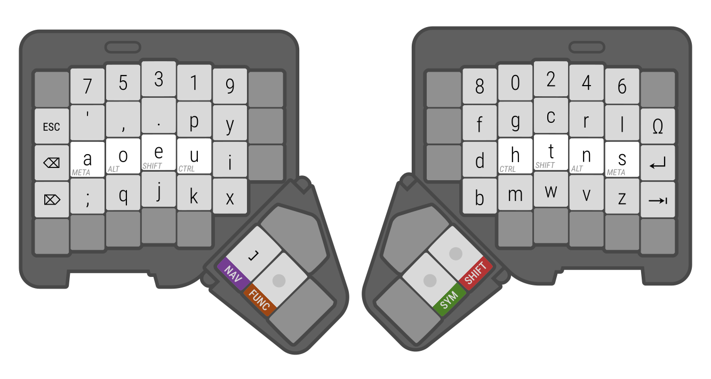
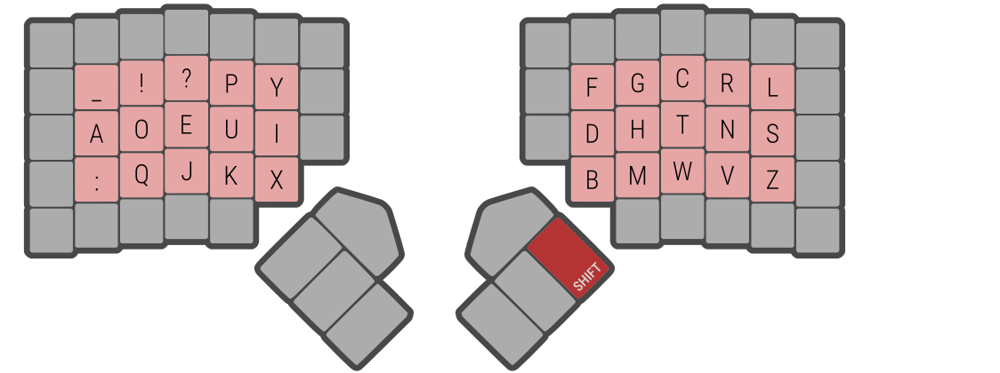

**Apollo** is a custom keyboard layout for the programmable ZSA Moonlander keyboard. It uses the DVORAK layout as a base for the letters while using custom layer keys for symbols. Designed to be comfortable to type on for coding, gaming, and media creation.

This is the default configuration.

## Shift Layer

The shift key behaves as expected

## Symbol Layer

