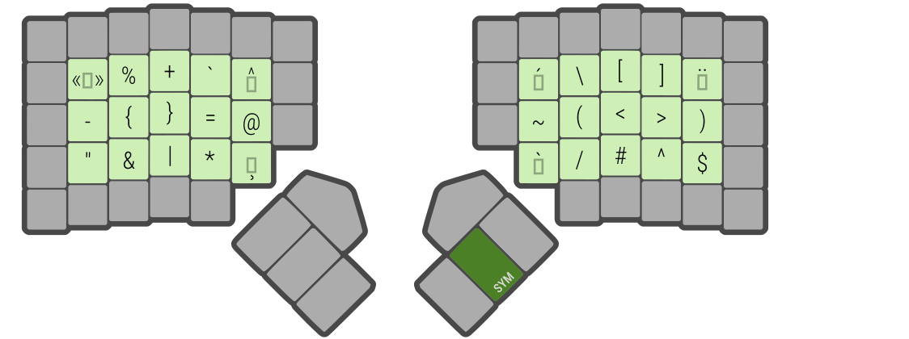
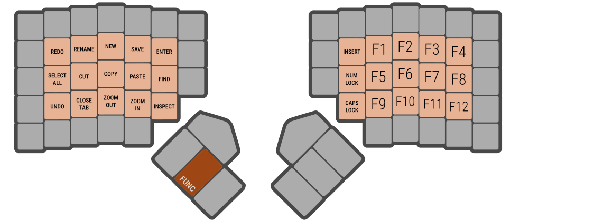
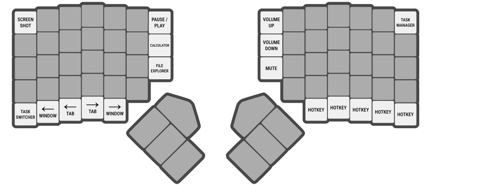

**Apollo** is a custom keyboard layout for the programmable ZSA Moonlander keyboard. It uses the DVORAK layout as a base for the letters while using custom layer keys for symbols. It's designed to be comfortable to type on for coding, gaming, and media creation.

Check out the layout on ZSA's [online configurator](https://configure.zsa.io/moonlander/layouts/gdQQ7/latest/0).

## The Layout

- **Letter Layout**
    - The letters are arranged as they appear in the original DVORAK layout.
- **Number Row**
    - The number row is setup so that the [most frequently appearing numbers](https://en.wikipedia.org/wiki/Benford%27s_law) are placed in the most comfortable positions.
    - The most common `0` and `1` use the index finger, while the less common `6` `7` `8` and `9` need a bit of a stretch.
    - The numbers are grouped into even and odd, almost identically to the original [programmer's Dvorak layout](https://www.kaufmann.no/roland/dvorak/).
- **Pinky Keys**
    - Backspace, delete, and escape are all located on the left pinky. This frees up the right hand to operate the mouse, and is useful for photo/video editing where these keys are pressed repeatedly.
- **Home Row Mods**
    - This layout uses [home row mods](https://precondition.github.io/home-row-mods). Holding down the main row letters `a`, `o`, `e`, `u` and `h`, `t`, `n`, `s` will send CTRL, ALT, SHIFT, or META.
    - Note that the shift key in this position isn't meant to be used to create capital letters; it's there for shortcuts.
- **Omega Key**
    - This key types an omega symbol. Useless on its own, but it's super handy when combined with text expander software like [Espanso](https://espanso.org/).
    - In an example setup, you could perhaps type `Ωcell` and it'll paste your cellphone number automatically. The macros are customizable.

The shift key, besides being used for capital letters, also grants access to some punctuation.

- **Punctuation**
    - `_`, `!`, `?`, and `:` are found on the shift layer. This is different from standard DVORAK, but for good reason.
    - Underscore and question mark had positions that were too far to the side to fit on the Moonlander. In addition, the `<`, `>`, and `"` keys that were originally on the shift layer are much better suited to the dedicated symbol layer.

The symbol layer contains all the remaining typed characters.

- **Programming Layout**
    - The position of each symbol on this layer was fine-tuned over prolonged usage. This layout places very common symbols in comfortable positions while also making sure that commonly typed programming patterns remain easy to type. The same finger is prevented from being used twice in a row as much as possible.
    - `()`, `[]`, `<>`, and `{}` are able to be typed in a rolling motion.
    - Having `<` and `>` on the symbol layer makes common programming patterns like `= >`, `- >` very easy.
    - Having `"` on the symbol layer is almost necessary, as it's extremely common in programming to have to type patterns like `(" ")`, `" " + " "`, `= " ";`. If it were still on the shift layer, it would add too much layer switching during programming.

- **International Keys**
    - This layout uses the Canadian Multilingual keymapping. This makes it possible to type accented letters. The relevant keys are represented by empty boxes with an accent.

This layer contains function keys on the right in addition to common keyboard shortcuts on the left.

- **Left-hand Shortcuts**
    - The essential shortcuts like cut `(ctrl+x)`, copy `(ctrl+c)`, paste `(ctrl+v)`, undo `(ctrl+z)`, and save `(ctrl+s)` require two hands on DVORAK. Having a seperate layer for these shortcuts allows for one-handed usage like in QWERTY.

Has the arrow keys, window controls, mouse movement, and scroll wheel keys.

The outside keys on the Moonlander are the least ergonomic to use. This makes them better off as occasional shortcuts rather than frequently used keys.

These hotkeys are mostly personal preference and are not integral to the layout.

TODO:

- gaming layers
- third thumb layers
